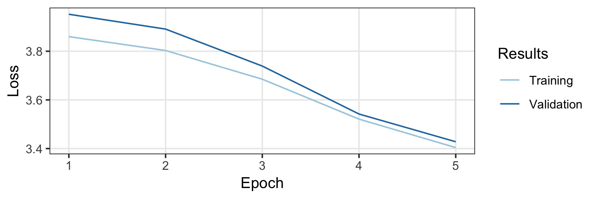

# ULMFIT for German

A pre-trained German language model for [ULMFIT](https://docs.fast.ai/text.html).

Because German is more inflective than English, it uses sub-word tokenzation to split text into chunks. It uses a pre-trained model [BPEmb](https://nlp.h-its.org/bpemb/) by Benjamin Heinzerling and Michael Strube with a fixed vocabulary size of 25k.

For instance, this German sentence:

> 'Zeitungskommentare sind eine hervorragende Möglichkeit zum Meinungsaustausch'

is broken in the following tokens:

> ['_zeitungs', 'komment', 'are', '_sind', '_eine', '_hervor', 'ragende', '_möglichkeit', '_zum', '_meinungs', 'austausch', '.']

## Usage

```python
from bpemb import BPEmb
from cleantext import clean
from fastai.text import *

# this will download the required model for sub-word tokenization
bpemb_de = BPEmb(lang="de", vs=25000, dim=300)

# contruct the vocabulary
itos = dict(enumerate(bpemb_de.words + ['xxpad']))
voc = Vocab(itos)

# encode all tokens as IDs
df_train['text'].apply(lambda x: bpemb_de.encode_ids_with_bos_eos(clean(x, lang='de')))

# setup language model data
data_lm = TextLMDataBunch.from_ids('exp', vocab=voc, train_ids=df_train['text'], valid_ids=df_valid['text'])

# setup learner, download the model beforehand
learn_lm = language_model_learner(data_lm)
learn_lm.load('path/to/model')

# ... training language model etc. ...

# setup test classifier data
# NB: set the padding index to 25000 (id of 'xxpad', see above)
classes = df_train['label'].unique().tolist()
data_clas = TextClasDataBunch.from_ids('exp', pad_idx=25000, vocab=voc, classes=classes,
    train_lbls=df_train['label'], train_ids=df_train['text'],
    valid_lbls=df_valid['label'], valid_ids=df_valid['text'])
```

See the [Notebook](Experiment_10kGNAD.ipynb) for a complete walkthrough.

## Training of the Language Model

The model was trained on the German Wikipedia and as well a national and regional German news articles. Only documents with a length of at least 500 were kept. This results into 3.278.657 documents with altogether 1.197.060.244 tokens. 5% of data is the validation set (chosen randomly) and the rest is the training set. To train it, we take the default configuration of the English language but fully disable dropout.
The amount of data is large enough such thats a strong regularization is not needed.
We trained for five epochs which took three days on a single GTX1800ti, with a batch size of 128. The learning rate is chosen automatically by the learning rate finder (0.007..). The training curves are in shown below and the final model achieves a perplexity of 32.52.. on the validation set.

<div align="center">
  
</div>

## Experiments

To test the performance of the model, I conducted experiments on the experiment dataset [10kGND](https://github.com/tblock/10kGNAD). The best consists of about 10k German news articles in 9 different classes. The best model achieved a accuray on the validation and test set of 91% and 88.3%, respectively. The details are in the accompanying [Notebook](Experiment_10kGNAD.ipynb).

## License

MIT.
